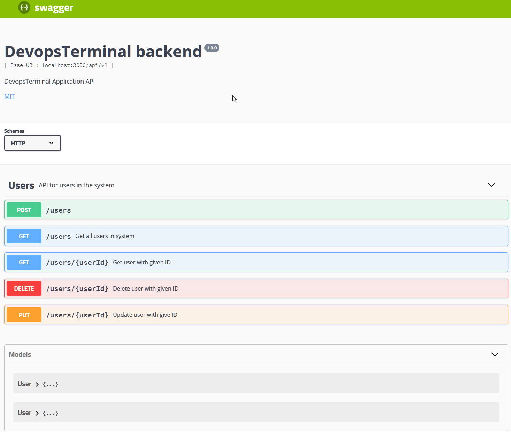

# swagger-to-existing-nodejs-project
Demo application that shows how to add Swagger UI Spec to existing Node.js/Express.js project

## Requirements

* Node.js v6.11.0
* MongoDB v3.4.6
* Gulp v3.9.1

## Usage

* Install dependencies `npm i`
* Start docker-compose `docker-compose up` or start you own MongoDB
* Start server `gulp develop`

Api documentation can be found on: `http://localhost:3000/api-docs`

## APICRA Scripts

    app_init.bat
    app_start.bat
    gulp_init.bat
    gulp_install.bat

## How it works

### Swagger API

## License

swagger-to-existing-nodejs-project is released under [MIT License](https://opensource.org/licenses/MIT).
